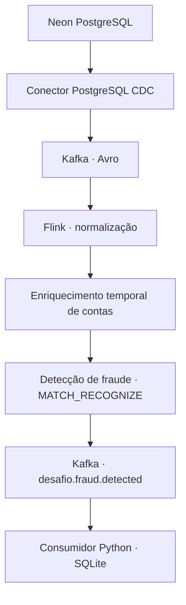

# Pipeline de pagamentos em tempo real


**Autor: Vando Ramos**
Desafio educacional IBM/DIO com Neon PostgreSQL e Confluent Cloud.

## Objetivo

Capturar alterações de um banco de pagamentos, processar transações em streaming e identificar três pagamentos positivos do mesmo cartão em até 60 segundos.

O projeto integra CDC, Kafka, contratos Avro, enriquecimento temporal com Flink e um consumidor Python que persiste os alertas no SQLite.

**Resultado:** fluxo integrado validado em 06/10/2026, com alerta recebido pelo consumidor e persistido uma vez para a chave de negócio testada.

## Arquitetura



O Schema Registry fornece os schemas Avro utilizados na serialização e desserialização.

## Tecnologias

| Componente | Tecnologia |
|---|---|
| Banco de origem | Neon PostgreSQL |
| Captura de alterações | PostgreSQL CDC Source V2 |
| Transporte de eventos | Apache Kafka no Confluent Cloud |
| Contratos | Avro e Schema Registry |
| Processamento | Apache Flink SQL |
| Consumidor | Python e confluent-kafka |
| Persistência de alertas | SQLite |

O ambiente Confluent é `desafio-final`, com cluster Basic `desafio-basic` em AWS `us-east-1`. O projeto Neon utiliza AWS Ohio (`us-east-2`).

## Dados e processamento

Todos os dados são sintéticos. A carga inicial contém:

| Tabela | Registros iniciais |
|---|---:|
| customers | 200 |
| accounts | 240 |
| cards | 320 |
| merchants | 60 |
| transactions | 2.000 |

As cinco tabelas participam da publicação `desafio_pub` e utilizam `REPLICA IDENTITY FULL`.

No Flink, o processamento foi organizado em quatro etapas:

1. **Contas normalizadas:** mantém o estado das contas em uma tabela upsert.
2. **Eventos de transações:** transforma inserções da origem em um fluxo append para detecção de padrões.
3. **Pagamentos enriquecidos:** realiza um `LEFT JOIN` temporal com as contas, acrescentando `customer_id` e `status`.
4. **Alertas:** aplica `MATCH_RECOGNIZE`, particionado por `card_id`.

A regra considera três transações com `amount > 0` em até 60 segundos. Utiliza `event_ts`, derivado do horário de negócio, com precisão de milissegundos e watermark de cinco segundos.

Updates e deletes permanecem na camada CDC, mas não entram na trilha de inserções utilizada pela regra. O enriquecimento acrescenta informações de conta; `customer_id` e `status` não participam da condição nem do payload final do alerta atual.

## Resultados validados

| Verificação | Resultado observado |
|---|---|
| CDC | Eventos de criação e atualização recebidos |
| Autenticação | Consumidor autenticado no Kafka e no Schema Registry |
| Avro | Chave e valor desserializados; `card_id` recuperado da chave |
| Enriquecimento | Lote 900501–900504 recebido uma vez por ID |
| Fraude integrada | Alerta 900501–900503, três transações, total 60.00 |
| Intervalo do alerta | 20 segundos |
| Consumo | Alerta recebido na partição 0, offset 11 |
| SQLite | Uma linha para a chave de negócio desse alerta |
| Teste negativo anterior | Duas transações positivas não geraram alerta durante a observação |

Exemplo do alerta integrado:

```json
{
  "card_id": 1,
  "primeira_transacao": 900501,
  "ultima_transacao": 900503,
  "account_id": 1,
  "quantidade": 3,
  "valor_total": "60.00",
  "inicio": "2026-10-06 04:41:07.713000+00:00",
  "fim": "2026-10-06 04:41:27.713000+00:00"
}
```

O consumidor grava no SQLite antes de confirmar o offset. Uma chave de negócio formada pelo cartão, primeira transação, última transação e regra evita novas linhas para o mesmo alerta.

Essa proteção é local ao SQLite e não representa garantia de exactly-once de todo o pipeline. O consumidor pode imprimir um alerta reprocessado mesmo quando a inserção duplicada é ignorada.

## Contratos e governança

O contrato isolado `Payment` utiliza o namespace `com.bootcamp.payments`, com valor monetário Avro decimal de precisão 15 e escala 2.

Os testes reais de compatibilidade produziram:

| Alteração | Política | Compatível |
|---|---|---|
| Adicionar `channel` com default | BACKWARD | Sim |
| Adicionar `channel` sem default | BACKWARD | Não |
| Remover `card_id` | BACKWARD | Sim |
| Remover `card_id` | FORWARD | Não |

Ao final, a política do subject de teste foi restaurada para BACKWARD.

Evidência: [compatibilidade.txt](docs/evidencias/compatibilidade.txt).

As tags `PII` foram aplicadas a `name` e `email` no schema de clientes. A tag `PCI` foi aplicada ao token do cartão e ao `card_id` do contrato isolado. Tags classificam dados; não criptografam nem restringem acesso por si só.

Os contratos de teste não substituem os envelopes Debezium da origem. O namespace personalizado do contrato Payment não implica que todos os schemas gerados pelo conector utilizem esse namespace.

## Segurança

- Usuário CDC com login, replicação e leitura nas cinco tabelas.
- Verificações confirmaram ausência de INSERT, UPDATE e DELETE nas tabelas, além de ausência dos atributos administrativos consultados.
- Credenciais Kafka e Schema Registry separadas por recurso.
- Consumidor com leitura dos subjects de chave e valor do tópico de alertas.
- Senhas, arquivos `.env`, banco SQLite e configurações em `.runtime/` ignorados pelo Git.
- Dados sintéticos, sem armazenamento de PAN ou CVV.

As permissões temporárias usadas nos testes de contratos e as chaves antigas devem ser revisadas ao encerrar o laboratório.

## Organização do repositório

| Caminho | Finalidade |
|---|---|
| `consumer.py` | Consumo Avro e persistência dos alertas |
| `sql/` | Banco, usuário CDC, testes, Flink e encerramento Neon |
| `schemas/` | Contratos Avro e variantes de compatibilidade |
| `connectors/` | Modelo de configuração do conector |
| `scripts/compatibility.py` | Testes no subject isolado |
| `scripts/render_connector.py` | Geração privada da configuração do conector |
| `setup.sh` | Preparação do banco e configuração |
| `teardown.sh` | Auxílio à remoção de recursos cloud por IDs |
| `docs/PROGRESSO.md` | Registro das validações e limitações |
| `docs/evidencias/` | Evidências exportadas |

## Execução

### Pré-requisitos

Python 3.12 foi utilizado na validação. A preparação do banco requer Bash e cliente `psql`. Os comandos cloud presentes no script de teardown requerem a CLI Confluent.

Também são necessários um projeto Neon com replicação lógica habilitada e recursos Confluent Cloud para Kafka, Connect, Schema Registry e Flink.

### Consumidor

Na pasta deste desafio:

```bash
python3 -m venv .venv
source .venv/bin/activate
pip install -r requirements.txt
```

Configure de forma privada as variáveis:

- `BOOTSTRAP_SERVERS`
- `CONSUMER_KEY`
- `CONSUMER_SECRET`
- `SR_URL`
- `SR_KEY`
- `SR_SECRET`

Se elas estiverem em um arquivo `.env` local com atribuições Bash válidas:

```bash
chmod 600 .env
set -a
source .env
set +a
python3 consumer.py
```

O arquivo deve ser criado e preenchido localmente. Não publique suas credenciais.

### Banco e Flink

O `setup.sh` prepara o banco e gera a configuração privada do conector. Ele não provisiona automaticamente todos os recursos cloud.

O seed é carregado somente quando as cinco tabelas estão vazias. Contagens abaixo da base esperada interrompem essa etapa; contagens suficientes não comprovam a integridade dos dados existentes.

Os statements de [sql/07-flink-modelo.sql](sql/07-flink-modelo.sql) devem ser executados individualmente, após conferir o catálogo, os schemas e os jobs ativos. Os INSERTs são contínuos: não execute novamente um job já ativo nem execute o arquivo inteiro indiscriminadamente.

## Recuperação e limitações

Reexecuções durante o laboratório produziram duplicações históricas no tópico enriquecido. O lote 900501–900504 foi posteriormente verificado com uma ocorrência por ID.

O detector atual utiliza um corte em `event_ts >= 2026-10-06 04:41:00 UTC` para excluir o histórico contaminado. Esse corte:

- não apaga as cópias antigas;
- não implementa deduplicação;
- deve ser revisto ao reproduzir o projeto em outro ambiente.

O histórico de contas anterior ao início da normalização pode não estar disponível para o join temporal.

O teste negativo registrado foi realizado no fluxo anterior. A repetição desse teste no fluxo integrado, a medição de latência e o registro de métricas e custos permanecem como melhorias de documentação e validação.

A automação integral de provisionamento e encerramento ainda não está concluída.

## Encerramento do laboratório

O encerramento deve considerar os recursos exclusivos do desafio:

1. Identificar e encerrar os statements Flink e excluir o conector CDC.
2. Verificar a conclusão das operações no painel.
3. Remover o compute pool e demais recursos cloud exclusivos, conforme dependências.
4. Depois de interromper o conector, remover o slot inativo e a publicação no Neon.
5. Conferir billing, chaves e permissões remanescentes.

O SQL Neon possui uma proteção contra slot ativo e mantém as tabelas e os dados. Ele utiliza comandos próprios do `psql`.

O `teardown.sh` é parcial e depende da CLI Confluent, que não estava instalada na máquina durante a revisão. Seus parâmetros devem ser conferidos na versão instalada antes do uso. O teardown completo não foi executado nem apresentado como evidência.

Créditos de avaliação não significam consumo zero; recursos ativos devem ser acompanhados até o encerramento.

## Referências

- [PostgreSQL CDC Source V2](https://docs.confluent.io/cloud/current/connectors/cc-postgresql-cdc-source-v2-debezium/cc-postgresql-cdc-source-v2-debezium.html)
- [Compatibilidade de schemas](https://developer.confluent.io/courses/schema-registry/schema-compatibility/)
- [Joins no Flink](https://docs.confluent.io/cloud/current/flink/reference/queries/joins.html)
- [MATCH_RECOGNIZE](https://docs.confluent.io/cloud/current/flink/reference/queries/match_recognize.html)
